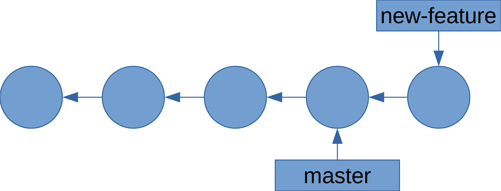
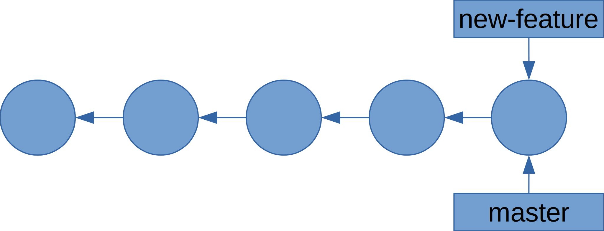
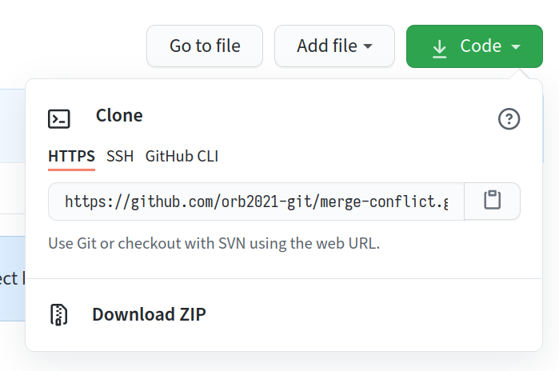
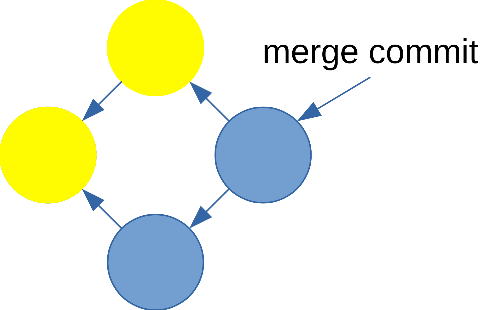

% Introduction to Git (and GitHub)
% [{.logo-img style="height: 5ex;"}](https://nushackers.org){target="_blank"}
% 7th March, 2023

---

## Slides

https://hckr.cc/ht-git-slides

---

## Things you need


[{.logo-img style="height: 5ex;"}](https://git-scm.com)

[{.logo-img style="height: 5ex;"}](https://github.com)

---


## Things to keep with you

-   [Git manual](https://git-scm.com/docs)
-   [{.logo-img style="height: 10ex;"}](https://git-scm.com/book/en/v2)

---

## What is **version control** and why should you care?
-   A **version control system (VCS)** helps to record changes to a file or a set of files over time.
-   It allows you to revert a project to a previous state, or to compare changes over time.

---

## Git lore

-   BitKeeper was a proprietary version control system that was used to manage the development of the Linux kernel.
-   In 2005, the company withdrew the free license, leading to controversy within the Linux community.
-   Linus Torvalds disliked many of the existing VCS, so he decided to create his own.

---

## What is Git?

<!---
TODO: comparison graph
-->
A distributed version control system (DVCS)

Every commit is a *snapshot* of your files

{.white-bg}

---

## The three \"areas\"

-   Working directory: where you actually work
-   Index/\"staging\" area: where you construct a commit
-   Repository/commit: the repository itself

{.white-bg style="height: 15ex"}

---

## Getting started

In each commit, Git stores the author and committer\'s name and email

You need to configure Git:

    git config --global user.name "Your Name"
    git config --global user.email "your@email.com"

---

## Setting your editor

Git sometimes launches an editor e.g. when you `commit`, to edit the
commit message

Configure your favourite editor:

    git config --global core.editor nano
    git config --global core.editor emacs
    # VS Code
    git config --global core.editor "code --wait --new-window"
    # For Windows
    git config --global core.editor "'C:/Program Files/Notepad++/notepad++.exe' -multiInst -nosession"
    git config --global core.editor "'C:/Program Files/Microsoft VS Code/code.exe' -n -w"

---

## Git manual

You can always access the help for a command via

`git help <cmd>`

or access the help summary by

`git <cmd> -h`

---

## Initialising a repository

Let\'s create a new Git repository.

~~~ {.bash-strong}
$ mkdir my-git-repo
$ cd my-git-repo
$ git init
~~~
    Initialized empty Git repository in my-git-repo/.git/

---

## Stage a file

Create a new file in `my-git-repo`, however you want. Then add it:

    $ echo 'Hello world' > hello
    $ git add hello

---

## Check the status

We\'ve just staged a file! So what is the state of the repository?

~~~ {.bash-strong}
$ git status
~~~
    On branch master

    No commits yet

    Changes to be committed:
      (use "git rm --cached <file>..." to unstage)

        new file:   hello

---

## Look at the staged diff

What exactly did we stage?

~~~ {.bash-strong}
$ git diff --staged
~~~
    diff --git a/hello b/hello
    new file mode 100644
    index 0000000..802992c
    --- /dev/null
    +++ b/hello
    @@ -0,0 +1 @@
    +Hello world

---

## Make your first commit

~~~ {.bash-strong}
$ git commit -m "Add hello"
~~~
    [master (root-commit) 5d74ce3] Add hello
     1 file changed, 1 insertion(+)
     create mode 100644 hello

You can leave the `-m ...` part out. Git will open your editor
for you to compose a commit message.

---

## Look at your commit

~~~ {.bash-strong}
$ git show
~~~
    commit dc37b1cb2627f9829db0072cfa7d3d6bf9eb6822 (HEAD -> master)
    Author: Your Name <your@email.com>
    Date:   Sat May 8 21:16:45 2021 +0800

        Add hello

    diff --git a/hello b/hello
    new file mode 100644
    index 0000000..802992c
    --- /dev/null
    +++ b/hello
    @@ -0,0 +1 @@
    +Hello world

---

## Make some changes, and look at them
Make edits to `hello` (or whatever file you made), then

~~~ {.bash-strong}
$ git diff
~~~
    diff --git a/hello b/hello
    index 802992c..5d56d4d 100644
    --- a/hello
    +++ b/hello
    @@ -1 +1 @@
    -Hello world
    +Hello Hackerschool!

---

## Viewing commit history

~~~ {.bash-strong}
$ git log
~~~
    commit 19c32155172a20f2fd14fe0e6c0fea954c17296b (HEAD -> master)
    Author: Your Name <your@email.com>
    Date:   Sat May 8 21:36:58 2021 +0800

        Change world to Hackerschool!

    commit dc37b1cb2627f9829db0072cfa7d3d6bf9eb6822
    Author: Your Name <your@email.com>
    Date:   Sat May 8 21:16:45 2021 +0800

        Add hello
---

## Ignoring files

Sometimes we don\'t want Git to track a certain file

~~~ {.bash-strong}
$ touch ignore-me
$ git status
~~~
    On branch master
    Untracked files:
      (use "git add <file>..." to include in what will be committed)

        ignore-me

    nothing added to commit but untracked files present (use "git add" to track)
---

## Ignoring files

We can add it to `.gitignore`

~~~ {.bash-strong}
$ echo "/ignore-me" >> .gitignore
$ git status
~~~
    On branch master
    Untracked files:
      (use "git add <file>..." to include in what will be committed)

        .gitignore

    nothing added to commit but untracked files present (use "git add" to track)

`.gitignore` should be committed.

---

## Ignoring files

~~~ {.bash-strong}
$ git add .gitignore && git commit -m "Add .gitignore"
~~~
    [master 5ada1cf] Add .gitignore
     1 file changed, 1 insertion(+)
     create mode 100644 .gitignore
~~~ {.bash-strong}
$ git status
~~~
    On branch master
    nothing to commit, working tree clean
~~~ {.bash-strong}
$ git status --ignored
~~~
    On branch master
    Ignored files:
      (use "git add -f <file>..." to include in what will be committed)

        ignore-me

    nothing to commit, working tree clean

---

## What to ignore?

Typically, we ignore files like build artifacts and generated files that
are usually derived from the human-authored code in the repository. E.g.

-   dependency caches like `/node_modules`
-   compiled code like `.o`, `.pyc` files
-   build output directories like `/bin`, `/out`
-   runtime-generated files like log files
-   personal configuration files e.g. of your IDE

---

## `.gitignore` format

    /logs/*/*.log
    /logs/**/*.log
    **/logs
    **/logs/debug.log
    *.log
    /debug.log
    debug.log

[See the full pattern
format.](https://git-scm.com/docs/gitignore#_pattern_format)

---

## Summary so far

::: {.font75}
-   [`git init`](https://git-scm.com/docs/git-init): Initialise
    repository
-   [`git add`](https://git-scm.com/docs/git-add): Stage changes
-   [`git diff`](https://git-scm.com/docs/git-diff)` `[`(--staged)`](https://git-scm.com/docs/git-diff#Documentation/git-diff.txt-emgitdiffemltoptionsgt--ltpathgt82308203):
    Look at differences between working tree and index (`--staged`:
    index and current commit)
-   [`git status`](https://git-scm.com/docs/git-status): Look at
    repository status
-   [`git commit`](https://git-scm.com/docs/git-commit)` `[`(-m)`](https://git-scm.com/docs/git-commit#Documentation/git-commit.txt--mltmsggt):
    Commit staged changes (`-m`: with this commit message)
-   [`git show`](https://git-scm.com/docs/git-show): Show current commit
-   [`git log`](https://git-scm.com/docs/git-log): View the log
-   `.gitignore`: Ignore files

The commands\' manuals are linked. (They all have *many* more options
than what we\'ve covered.)

:::

---

## Try it out!

Now take some time to try out the commands so far, create a new directory and try making your first commit.

::: { .font75 }
- Create a folder and initialize a git repo
- Create a new file and commit it
- Make some changes and push it again
- See your list of changes using `git log`
- BONUS: Use `.gitignore` to ignore some files you don't want to be commit. e.g. MacOS likes to store a resource fork as a hidden file in all your folders (`_MACOSX`). Let's make sure we don't commit that to our Git repo!

:::

---

## Branching, merging and collaboration

---

## Branches

::: { .font75 }
\... let you have multiple lines of development happen simultaneously.

In Git, branching is extremely fast and lightweight. A branch is simply
a pointer to a commit; the default branch is typically `master` or
`main`.

`HEAD` is a special pointer to the branch you are currently on.

{.white-bg style="height: 20ex;"}

:::

---

## Why use branching? {.font75}

-   work on **different versions of our code simultaneously**. Think of branches as alternative timelines.
-   create separate contexts where we can try new things or even **work on multiple ideas in parallel** without risking the codebase.
-   if feature A and feature B are being developed, if A breaks, it doesn't affect B.

---

## Creating a branch

    $ git checkout -b new-feature
    Switched to a new branch 'new-feature'
    $ git show
    commit 5ada... (HEAD -> new-feature, master)
    Author: Your Name <your@email.com>
    Date:   Sat May 8 21:44:32 2021 +0800

        Add .gitignore

Alternatively:

    $ git branch new-feature
    $ git checkout new-feature
    Switched to branch 'new-feature'

---

## Creating a branch

{.white-bg}

---

## Listing branches

    $ git branch
      master
    * new-feature

---

## Changing branches

    $ git checkout master
    Switched to branch 'master'

---

## Fast-forward merging

Let\'s develop `new-feature` a bit, then merge it back to `master`.

    $ echo "bye" > bye
    $ git add bye && git commit -m "Add farewell"
    [new-feature b53e9cf] Add farewell
     1 file changed, 1 insertion(+)
     create mode 100644 bye

---

## Fast-forward merging

{.white-bg}

---

## Fast-forward merging

    $ git checkout master
    Switched to branch 'master'
    $ git merge new-feature
    Updating 5ada1cf..b53e9cf
    Fast-forward
     bye | 1 +
     1 file changed, 1 insertion(+)
     create mode 100644 bye

---

## Fast-forward merging

{.white-bg}

---

## Deleting branches

Now that we\'re done with `new-feature`, we can delete it.

    $ git branch -d new-feature
    Deleted branch new-feature (was b53e9cf).

---

## Cloning repositories

Follow along!
We\'re going to clone a repository to use later on. Go to
[merge-conflict](https://github.com/hackerschool-git/merge-conflict),
and look for this:

{style="height: 20ex;"}

We'll go into more detail about remote repositories later

---

## Cloning repositories

    $ git clone https://github.com/hackerschool-git/merge-conflict.git
    Cloning into 'merge-conflict'...
    remote: Enumerating objects: 18, done.
    remote: Counting objects: 100% (18/18), done.
    remote: Compressing objects: 100% (10/10), done.
    remote: Total 18 (delta 0), reused 18 (delta 0), pack-reused 0
    Unpacking objects: 100% (18/18), done.
    $ cd merge-conflict/
    $ ls
    bye

---

## Merge conflicts setup

First, checkout `conflict-1` and `conflict-2` to create your local
copies of the branches. Then go back to `master`.

    $ git checkout conflict-1
    Branch 'conflict-1' set up to track remote branch 'conflict-1' from 'origin'.
    Switched to a new branch 'conflict-1'
    $ git checkout conflict-2
    Branch 'conflict-2' set up to track remote branch 'conflict-2' from 'origin'.
    Switched to a new branch 'conflict-2'
    $ git checkout master
    Switched to branch 'master'
    Your branch is up to date with 'origin/master'.

---

## Merge conflicts

{.white-bg}

---

## Merge conflicts

    $ git log --graph --all
    * commit ba119655f9009085d5f3fd72cf29787fe1aef05f (origin/conflict-2)
    | Author: Your Name <your@email.com>
    | Date:   Sun May 9 00:15:38 2021 +0800
    |
    |     Change bye to farewell
    |
    | * commit 87a92c314d38f8941f61053991086d16f08a5d6f (origin/conflict-1)
    |/  Author: Your Name <your@email.com>
    |   Date:   Sun May 9 00:15:15 2021 +0800
    |
    |       Make bye more formal
    |
    * commit b53e9cfb656a633f207b6099bf413c08a0011af5 (HEAD -> master, origin/master, origin/HEAD)

---

## Merge conflicts

Now, try to merge `conflict-1` and `conflict-2` into `master`.

    $ git merge conflict-1
    Updating b53e9cf..87a92c3
    Fast-forward
     bye | 2 +-
     1 file changed, 1 insertion(+), 1 deletion(-)
    $ git merge conflict-2
    Auto-merging bye
    CONFLICT (content): Merge conflict in bye
    Automatic merge failed; fix conflicts and then commit the result.

Oh no! [[Time to delete everything and start
over!](https://xkcd.com/1597/)]{style="font-size: 50%; text-decoration: line-through;"}

---

## Handling merge conflicts

    $ git status
    On branch master
    Your branch is ahead of 'origin/master' by 1 commit.
    (use "git push" to publish your local commits)

    You have unmerged paths.
    (fix conflicts and run "git commit")
    (use "git merge --abort" to abort the merge)

    Unmerged paths:
    (use "git add <file>..." to mark resolution)

    both modified:   bye

    no changes added to commit (use "git add" and/or "git commit -a")

---

## Handling merge conflicts

    $ cat bye
    <<<<<<< HEAD
    Goodbye!
    =======
    Farewell!
    >>>>>>> conflict-2

[What we have in `master`]{.mark}

[What we want to merge in `conflict-2`]{.mark-red}

---

## Handling merge conflicts

Fix the merge conflict however you\'d like, then commit.

    $ echo 'Farewell!' > bye
    $ git add bye && git commit
    [master 00e746b] Merge branch 'conflict-2'
    $ git show
    commit 00e746be657f4ca8e2adde376d09dd6af0533008 (HEAD -> master)
    Merge: 87a92c3 ba11965
    Author: Your Name <your@email.com>
    Date:   Sun May 9 00:43:12 2021 +0800

        Merge branch 'conflict-2'

---

## Handling merge conflicts

{.white-bg}

---

## Using and Navigating GitHub

---

## GitHub != Git

Git is a DVCS as mentioned earlier.

GitHub is a cloud based hosting service that's let's people manage Git repositories.

---

## Creating a new GitHub repository


---

## Creating a new GitHub repository


---

## Creating a new GitHub repository

{style="height: 22ex;"}

---

## Pushing to a new GitHub repository

    $ mkdir my-new-repo && cd my-new-repo
    $ git init
    Initialized empty Git repository in /tmp/my-new-repo/.git/
    $ echo 'Hello world!' > hello
    $ git add hello && git commit -m "Initial commit"
    [master (root-commit) 18cac44] Initial commit
     1 file changed, 1 insertion(+)
     create mode 100644 hello
    $ git remote add origin git@github.com:.../my-new-repo.git
    $ git push -u origin master
    Enumerating objects: 3, done.
    Counting objects: 100% (3/3), done.
    Writing objects: 100% (3/3), 220 bytes | 220.00 KiB/s, done.
    Total 3 (delta 0), reused 0 (delta 0)
    To github.com:.../my-new-repo.git
     * [new branch]      master -> master
    Branch 'master' set up to track remote branch 'master' from 'origin'.

---

## Updating your repository

    $ git pull origin master
    From https://github.com/hackerschool-git/fork-me
     * branch            master     -> FETCH_HEAD
    Already up to date.

Alternatively, if your branch is tracking a remote:

    $ git pull
    Already up to date.

`pull` is roughly equivalent to a `fetch` and `merge`.

So if there are merge conflicts, you handle them as you did earlier.

---

## Updating with rebase

    $ git pull --rebase
    Already up to date.

---

## Rebase vs merge

{.white-bg}

{.white-bg}

---

## HTTPS vs SSH

It doesn\'t really matter.

Use HTTPS if you don\'t have an SSH key set up with GitHub, or if it is
a repository that you cannot write to.

Use SSH if you have an SSH key set up, and you can write to the
repository.

---

## Or it kinda does

::: { .font75 }
Using your GitHub password is no longer allowed after **August 13, 2021**. If you use HTTPS, you'll need to create a Personal Access Token (PAT).

In your GitHub account, go to

`Settings > Developer Settings > Personal Access Token`

to generate one.

:::

---

## Or does it?

Some enteprise network/universities may block SSH connections. However, you can try using SSH over HTTPS port (443).

    $ ssh -T -p 443 git@ssh.github.com
    > Hi USERNAME! You've successfully authenticated, but GitHub does not
    > provide shell access.

---

## Or does it?

If you get the success message, you can proceed to set SSH over HTTPS as a default connection by adding this to your `.ssh/config`

    Host github.com
    Hostname ssh.github.com
    Port 443
    User git

---

## Forking and PR setup

Clone this repository:
[fork-me](https://github.com/hackerschool-git/fork-me).

    $ git clone https://github.com/hackerschool-git/fork-me.git
    Cloning into 'fork-me'...
    remote: Enumerating objects: 3, done.
    remote: Counting objects: 100% (3/3), done.
    remote: Total 3 (delta 0), reused 3 (delta 0), pack-reused 0
    Unpacking objects: 100% (3/3), done.

---

## Forking and PR

You\'ve made some improvements, and now you want it upstreamed!

    $ cd fork-me/
    $ nano hello # Edit hello
    $ git add hello && git commit -m "Improve hello"
    [master df48f95] Improve hello
     1 file changed, 1 insertion(+), 1 deletion(-)

---

## Forking and PR

Fork the repository:


---

## Forking and PR

Get the URL:


---

## Update your repository

Make sure there haven\'t been new changes made to the upstream.

    $ git pull --rebase
    Already up to date.

We use `--rebase` because merge commits are generally frowned-upon in
GitHub-style PRs.

Also merge commits will look extremely funky in your PRs.

---

## Forking and PR

Add the remote, and push

    $ git remote add fork git@github.com:.../fork-me.git
    $ git push fork master
    Enumerating objects: 5, done.
    Counting objects: 100% (5/5), done.
    Writing objects: 100% (3/3), 248 bytes | 248.00 KiB/s, done.
    Total 3 (delta 0), reused 0 (delta 0)
    To github.com:.../fork-me.git
       18cac44..df48f95  master -> master

---

## Forking and PR


---

## Forking and PR


---

## Forking and PR


---

## Commit message discipline

First line: 80-character title, phrased imperatively

Then if your change is complex, elaborate on the change in prose.

``` font45
Change greeting from "Hi" to "Hello"

"Hi" is a bit too informal for a greeting. We should change it to "Hello" instead,
so that our users don't feel like we are being too informal. Blah blah blah blah.
Blah blah.
```

---

## A real commit message

[Randomly chosen from the Linux
kernel.](https://git.kernel.org/pub/scm/linux/kernel/git/torvalds/linux.git/commit/?id=37c0aead7902b1ddf1b668e1ab74c80b9a7fd183)

``` font45
net_sched: sch_fq: handle non connected flows

FQ packet scheduler assumed that packets could be classified
based on their owning socket.

This means that if a UDP server uses one UDP socket to send
packets to different destinations, packets all land
in one FQ flow.

This is unfair, since each TCP flow has a unique bucket, meaning
that in case of pressure (fully utilised uplink), TCP flows
have more share of the bandwidth.

If we instead detect unconnected sockets, we can use a stochastic
hash based on the 4-tuple hash.

This also means a QUIC server using one UDP socket will properly
spread the outgoing packets to different buckets, and in-kernel
pacing based on EDT model will no longer risk having big rb-tree on
one flow.

Note that UDP application might provide the skb->hash in an
ancillary message at sendmsg() time to avoid the cost of a dissection
in fq packet scheduler.

Signed-off-by: Eric Dumazet <edumazet@google.com>
Signed-off-by: David S. Miller <davem@davemloft.net>
```

---

## GitHub tip

You can create [pull
requests](https://github.com/nushackers/nushackers-site/pull/252)
between branches in the same repository.

This is useful if you want your team to review something before
merging, or if you set up automated CI checks, etc.

{style="height: 12ex"}

---

## Summary since the last summary

-   [`git checkout`](https://git-scm.com/docs/git-checkout): Checkout a
    branch (and also files, etc)
-   [`git merge`](https://git-scm.com/docs/git-merge): Merge a branch
-   [`git clone`](https://git-scm.com/docs/git-clone): Clone a remote
    repository
-   [`git remote`](https://git-scm.com/docs/git-remote): Manage remotes
-   [`git push`](https://git-scm.com/docs/git-push): Push your branch to
    a remote
-   [`git pull`](https://git-scm.com/docs/git-pull): Pull updates from a
    remote to your repository

---

## Commit manipulation

---

## Clone another repo

Let\'s clone [another
repository](https://github.com/hackerschool-git/big-repo) to use for
this section.

    $ git clone https://github.com/hackerschool-git/big-repo.git
    Cloning into 'big-repo'...
    remote: Enumerating objects: 12, done.
    remote: Counting objects: 100% (12/12), done.
    remote: Compressing objects: 100% (5/5), done.
    remote: Total 12 (delta 0), reused 12 (delta 0), pack-reused 0
    Receiving objects: 100% (12/12), done.

---

## This repository

    $ git log --graph --all --oneline
    * d1f4fcc (HEAD -> master, origin/master, origin/HEAD) Add file3
    | * 367597c (origin/new-file) Add file2
    |/
    * 643aec6 Update file to c
    * 4ec21c7 Update file to b
    * 055cab4 Initial commit

---

## Revert

Create a commit to reverse a previous commit.

    $ git log --graph --oneline
    * d1f4fcc (HEAD -> master, origin/master, origin/HEAD) Add file3
    * 643aec6 Update file to c
    * 4ec21c7 Update file to b
    * 055cab4 Initial commit

Suppose we want to revert [this]{.mark} commit.

---

## Revert

    $ git revert 643aec6
    [master 7b73baf] Revert "Update file to c"
     1 file changed, 1 insertion(+), 1 deletion(-)
    $ git show
    commit 7b73baf229e2b8db19bc594c450743b50adf649d (HEAD -> master)
    Author: Your Name <your@email.com>
    Date:   Tue May 11 01:21:31 2021 +0800

        Revert "Update file to c"

        This reverts commit 643aec6d2a1b4cd485d678886fc1cef25b15bee0.

    diff --git a/file b/file
    index f2ad6c7..6178079 100644
    --- a/file
    +++ b/file
    @@ -1 +1 @@
    -c
    +b

---

## Reset

Undo `git add`.

    $ echo e > file
    $ git add file
    $ git status
    On branch master
    Changes to be committed:
      (use "git restore --staged <file>..." to unstage)
        modified:   file
    $ git reset file
    Unstaged changes after reset:
    M   file
    $ git status
    On branch master
    Changes not staged for commit:
      (use "git add <file>..." to update what will be committed)
      (use "git restore <file>..." to discard changes in working directory)
        modified:   file
    no changes added to commit (use "git add" and/or "git commit -a")

---

## Checkout

Undo changes to a file in the working tree.

    $ echo e > file
    $ git status
    On branch master
    Changes not staged for commit:
      (use "git add <file>..." to update what will be committed)
      (use "git restore <file>..." to discard changes in working directory)
        modified:   file

    no changes added to commit (use "git add" and/or "git commit -a")
    $ git checkout -- file
    $ git status
    On branch master
    nothing to commit, working tree clean

---

## Summary since the last summary

-   [`git revert`](https://git-scm.com/docs/git-revert): Revert a commit
-   [`git reset`](https://git-scm.com/docs/git-reset): Unstage files
-   [`git checkout`](https://git-scm.com/docs/git-checkout): Checkout
    files (and also a branch)
    commits
-   [`git reset`](https://git-scm.com/docs/git-reset) (2):
    Move/\"reset\" a branch
    branch

---

## Cool Git/GitHub stuff you can do

Honestly if you just want to *learn* how to use Git, you can stop here, but there's so much more you *can* do!

---

## Some activities you can try
Clone a repo you might be interested in and follow along! Some examples:

-   [Linux Kernel](https://github.com/torvalds/linux)
-   [Musescore](https://github.com/musescore/MuseScore)
-   [Vue](https://github.com/vuejs/vue)
-   [GPU.js](https://github.com/gpujs/gpu.js/)

---

## Git aliases
For any medium to large Git projects, the `git log` will be extremely long and hard to read.
We can pass is some flags to make it really readable.

    git log --graph --decorate --pretty=oneline --abbrev-commit --all
    git log --graph --abbrev-commit --decorate --format=format:'%C(bold blue)    %h%C(reset) - %C(bold green)(%ar)%C(reset) %C(white)%s%C(reset) %C(dim white    )- %an%C(reset)%C(auto)%d%C(reset)'

---

## Git aliases

But imagine having to type all that all the time! Can we alias it?

    git config --global alias.lola "log --graph --decorate --pretty=oneline --abbrev-commit --all"
    git config --global alias.lg "log --graph --abbrev-commit --decorate --format=format:'%C(bold blue)    %h%C(reset) - %C(bold green)(%ar)%C(reset) %C(white)%s%C(reset) %C(dim white    )- %an%C(reset)%C(auto)%d%C(reset)'"

Now we can type something like `git lola` or `git lg` to get a nice concise log!

---

## Checking out specific commits

Each git commit has a *hash* attached to it. We can use this unique hash to checkout a specific commit.

    git checkout <commit-hash>

---

## Diffing branches/commits

You can quite easily extend `git diff` to diff two different branches/commits

    git diff branch-1 branch-2

---

## Oh no! I messed up and I reset/revert/touched something I shouldn't have

---

## Reflog

`git reflog` is a reference log of all your actions you've done using git.
Find the hash in reflog you want to go to and do

    git reset --hard <reflog-hash>

With this you can undo (almost) anything in git!

---

## That's a lot of cool Git stuff, what about GitHub?

---

## Comparing branches in GitHub

Go to any repo you want on github, then add `/compare` to the back of the URL and try comparing different branches! Here are some you can try:

-   [Neovim](https://github.com/neovim/neovim/compare)
-   [Source Academy's frontend](https://github.com/source-academy/frontend/compare)

---

## Code in GitHub

What if you found a typo on one line of code, and you want to quickly edit it? You can replace `.com` in the url to a `.dev` to open a VSCode environment with the GitHub Repo. Here's some cool stuff you can try looking at:

-   [NUSMods](https://github.dev/nusmodifications/nusmods)
-   [MarkBind](https://github.dev/MarkBind/markbind)

---

## Where to go from here?

-   [`git rebase`](https://git-scm.com/docs/git-rebase): \"Rebase\" a
    branch
-   [`git add -p`](https://git-scm.com/docs/git-add): Interactively add
-   [Specifying commit ranges](https://git-scm.com/docs/git-rev-list):
    for commands like log, cherry-pick, etc
-   [`git rebase -i`](https://git-scm.com/docs/git-rebase): interactive
    rebase---edit history
-   [`git bisect`](https://git-scm.com/docs/git-bisect): Find the first
    commit with a bug, etc
-   [`git submodule`](https://git-scm.com/docs/git-submodule): Include
    another repository in your current repository
-   [`git subtree`](https://man.archlinux.org/man/git-subtree.1):
    Extract a subdirectory (incl. commit history) into a separate
    repository

---

## Where to go from here?

-   Look into [Git
workflows](https://git-scm.com/book/en/v2/Distributed-Git-Distributed-Workflows#ch05-distributed-git)
-   If you're interested in how version control works with lots of technical details,
look into [Customizing Git](https://git-scm.com/book/en/v2/Customizing-Git-Git-Configuration) and [Git Internals](https://git-scm.com/book/en/v2/Git-Internals-Plumbing-and-Porcelain)
-   GitHub isn't the only way you can share you repositories online! You could even self host your own Git servers.
-   Why stop at learning? [Build your own Git!](https://github.com/codecrafters-io/build-your-own-x#build-your-own-git)

---

## Where to go from here?

Check out Hackerschool: Advanced Git\
(last run on 7 Nov 2020)

Recording: <https://www.youtube.com/watch?v=pGAorBdZ6Y8>

Slides: <https://hs2010-git.github.io/adv>

---

## End


