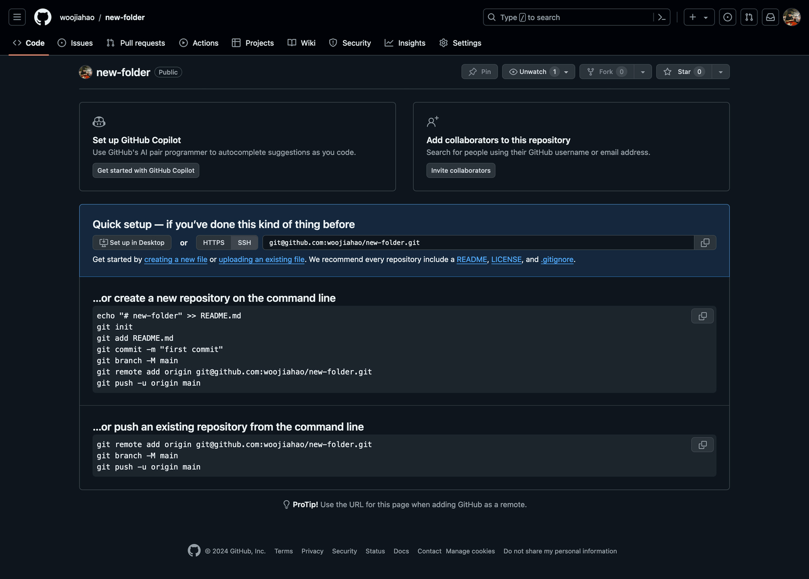
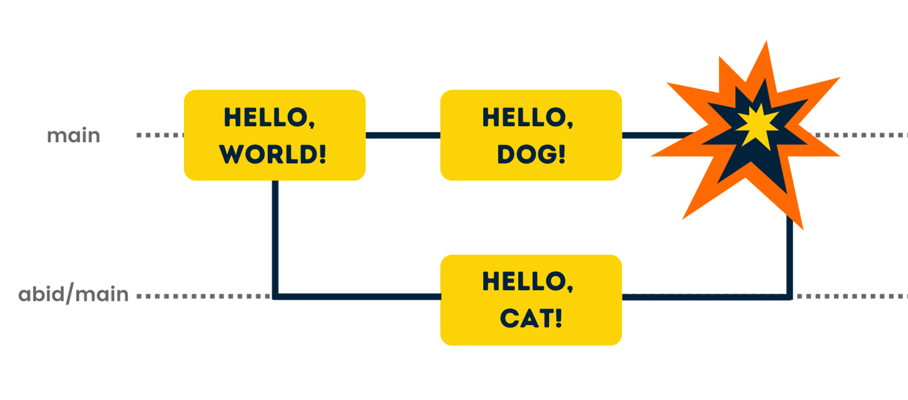

<script type="module">
  import mermaid from 'https://cdn.jsdelivr.net/npm/mermaid@10/dist/mermaid.esm.min.mjs';
  mermaid.initialize({
    startOnLoad: true,
    theme: 'dark'
  });
</script>

[](https://nushackers.org)

PRESENTS

Introduction to Git (and GitHub)
18 May 2024

---

## References

These slides are complemented by the wiki so please refer to it for more details/information

[Wiki](https://wiki.nushackers.org/orbital/git)
[Slides](https://hckr.cc/orbital24-git-slides)

---

## Setup Issues

Quick check: Did anyone face any problems setting up Git on your machine or creating an account on
GitHub?

If you have any issues, refer to the [setup guide provided in the wiki.](https://wiki.nushackers.org/orbital/git/setup)

---

## Things you need

[](https://git-scm.com)

[](https://github.com)

---

# Fundamental Concepts

---

## What is Git?

- Distributed version control system (DVCS)
- Created by Linus Torvalds in 2005 as a replacement for existing VCS for the Linux kernel

<!-- {.white-bg} -->

---

## What is **version control**?

- A **version control system (VCS)** helps to record changes to a file or a set of files over time
- It allows you to revert a project to a previous state, or to compare changes over time
- Acts as an "undo" button for your code and lets your collaborate with your team

---

## Local vs remote repositories

- **Repository:** parent folder that Git monitors for changes
- **Local:** exists on local machine
- **Remote:** exists on external server such as Github

---

## Thinking in commits

- Snapshot of the instance of the codebase at a given point in time
- Incrementally added over past snapshots as a set of changes
- Visualized as a Directed Acyclic Graph (DAG)


---

## Branching away

- Independent line of work that stems/branches off from a point in development
- Useful for isolating bug fixes/features
- Default branch: `main`

---

## Adding files to a snapshot

- Working directory: where you actually work
- Index/\"staging\" area: where you construct a commit
- Repository/commit: the repository itself

<div>

</div>

---

# Getting Started

---

## Creating a local repository

```sh
mkdir new-folder/
cd new-folder/
git init
```

---

## Adding a file

```sh
echo 'Hello world' >> hello.txt
```

---

## Adding `hello.txt` to your snapshot

```sh
git add hello.txt
```

---

## Taking the snapshot

```sh
git commit -m "First commit"
```

---

# Integrating Remote Repositories

---

## Creating a new GitHub repository

Go to <https://github.com/new>

<div>


</div>

---

## Creating a new GitHub repository

<div>

</div>

---

## Creating a new GitHub repository

<div>

</div>

---

## Connecting local repository to remote repository

```sh
git remote add origin git@github.com:<github username>/<repository name>.git
git branch -M main
```

---

## Uploading local repository snapshots

```sh
git push -u orign main
```

---

## Cloning remote repositories

Downloading a local copy of the repository

```
cd ../
git clone git@github.com:<github username>/<repository name>.git another-folder/
```

---

# Branching

---

## What is a branch?

A branch is an independent line of development, often used for features or bug fixes

<div>

</div>

---

## HEAD

`HEAD` is a special name given to the current commit of your current branch for ease of reference

<div>

</div>

---

## Creating a branch

```sh
git checkout -b new-feature
```

Alternatively:

```sh
git branch new-feature
git checkout new-feature
```

---

## Changing branches

```sh
git checkout main
```

---

## Viewing all branches

```sh
git branch -v
```

## Deleting a branch

```sh
git branch -d <branch name>
```

## Renaming a branch

```sh
git branch -m <new branch name>
```

---

## Combining changes of branches

`main` is the target branch, `feature-A` is the source branch

```sh
git checkout main
git merge feature-A
```

---

# Merge Conflicts

---

## Merge conflicts

Occur when two (or more) modifications are made to the same line of a file; creating a state of confusion for Git

<div>

</div>

---

## Simulating merge conflicts

In your repository, create branch `conflict-1` from `main` and edit the first line of `hello.txt`

```sh
git checkout -b conflict-1
```

Return to `main` and create another branch `conflict-2` from `main` and edit the first line of `hello.txt` again

```sh
git checkout main
git checkout -b conflict-2
```

---

## Merge conflicts

Now, try to merge `conflict-1` and `conflict-2` into `main`.

```sh
git merge conflict-1
```

```text
Updating b53e9cf..87a92c3
Fast-forward
    hello.txt | 2 +-
    1 file changed, 1 insertion(+), 1 deletion(-)
```

---

## Merge conflicts

```sh
git merge conflict-2
```

```text
Auto-merging hello.txt
CONFLICT (content): Merge conflict in hello.txt
Automatic merge failed; fix conflicts and then commit the result.
```

---

## Handling merge conflicts

```
On branch master
Your branch is ahead of 'origin/master' by 1 commit.
(use "git push" to publish your local commits)

You have unmerged paths.
(fix conflicts and run "git commit")
(use "git merge --abort" to abort the merge)

Unmerged paths:
(use "git add <file>..." to mark resolution)

both modified:   hello.txt

no changes added to commit (use "git add" and/or "git commit -a")
```

---

## Handling merge conflicts

```
$ cat hello.txt
<<<<<<< HEAD
Goodbye!
=======
Farewell!
>>>>>>> conflict-2
```

Top half: current content in branch

Bottom half: content that is about to be merged

---

## Handling merge conflicts

<!-- TODO: MUST DEMO TO EXPLAIN -->
Edit `hello.txt` as such...

---

## Completing the process

Commit the conflicting file

```sh
git commit
```

---

# Intermission

5 minutes...

In the meantime, try out the commands that you have learnt!

Add new files, edit them, commit them, and stage them!

---

# Collaborative Workflows

---

## Common Workflows

1. Fork & PR
2. Branch & PR

This workshop focuses on the former - "Fork & PR"

The wiki contains more information about [Branch & PR](https://wiki.nushackers.org/orbital/git/collaborative-workflows/branch-and-pr-workflow)

---

## What is a PR?

Pull requests are like a Request for Comments for a set of changes made on a separate branch

Allows developers and contributors to share their comments on the changes

---

## Creating a PR

Push a local branch to a remote repository

```sh
git checkout -b sample-pr
vim hello.txt
git add hello.txt
git commit -m "new changes"
git push origin sample-pr
```

Visit GitHub to create the PR ([screenshots on the wiki](https://wiki.nushackers.org/orbital/git/collaborative-workflows))

---

## Fork & PR workflow

**Forking:** creating an at-the-time copy of a remote repository (only needs to be done once per remote repository)

**Upstream:** common name for the original repository

---

## Hands-on time!

1. Create a fork of the demo repository
2. Clone the fork to local machine
3. Make changes to the repository
4. Commit changes
5. Push changes to forked repository
6. Create PR through Github

---

# Intermission!

5 minute break and Q&A!

---

## Additional concepts

---

## Commit manipulation

---

## Revert

Undo accidental changes made

```sh
$ git log --graph --oneline
* d1f4fcc (HEAD -> master, origin/master, origin/HEAD) Add file3
* 643aec6 Update file to c
* 4ec21c7 Update file to b
* 055cab4 Initial commit
```

Suppose we want to revert to commit `643aec6`.

---

## Revert

```sh
$ git revert 643aec6
[master 7b73baf] Revert "Update file to c"
    1 file changed, 1 insertion(+), 1 deletion(-)
$ git show
commit 7b73baf229e2b8db19bc594c450743b50adf649d (HEAD -> master)
Author: Your Name <your@email.com>
Date:   Tue May 11 01:21:31 2021 +0800

    Revert "Update file to c"

    This reverts commit 643aec6d2a1b4cd485d678886fc1cef25b15bee0.

diff --git a/file b/file
index f2ad6c7..6178079 100644
--- a/file
+++ b/file
@@ -1 +1 @@
-c
+b
```

---

## Reset

Undo `git add`.

```
$ git status
On branch master
Changes to be committed:
    (use "git restore --staged <file>..." to unstage)
    modified:   file
$ git reset file
Unstaged changes after reset:
M   file
$ git status
On branch master
Changes not staged for commit:
    (use "git add <file>..." to update what will be committed)
    (use "git restore <file>..." to discard changes in working directory)
    modified:   file
no changes added to commit (use "git add" and/or "git commit -a")
```

---

## Checkout

Undo changes to a file in the working tree.

```
$ echo e > file
$ git status
On branch master
Changes not staged for commit:
    (use "git add <file>..." to update what will be committed)
    (use "git restore <file>..." to discard changes in working directory)
    modified:   file

no changes added to commit (use "git add" and/or "git commit -a")
$ git checkout -- file
$ git status
On branch master
nothing to commit, working tree clean
```

---

## Ignoring files

Sometimes we don\'t want Git to track a certain file

~~~ {.bash-strong}
$ touch ignore-me
$ git status
~~~
    On branch master
    Untracked files:
      (use "git add <file>..." to include in what will be committed)

        ignore-me

    nothing added to commit but untracked files present (use "git add" to track)
---

## Ignoring files

We can add it to `.gitignore`

~~~ {.bash-strong}
$ echo "/ignore-me" >> .gitignore
$ git status
~~~
    On branch master
    Untracked files:
      (use "git add <file>..." to include in what will be committed)

        .gitignore

    nothing added to commit but untracked files present (use "git add" to track)

`.gitignore` should be committed.

---

## Viewing ignored files

~~~ {.bash-strong}
$ git status --ignored
~~~
    On branch master
    Ignored files:
      (use "git add -f <file>..." to include in what will be committed)

        ignore-me

    nothing to commit, working tree clean

---

## What to ignore?

Typically, we ignore files like build artifacts and generated files that
are usually derived from the human-authored code in the repository. E.g.

-   dependency caches like `/node_modules`
-   compiled code like `.o`, `.pyc` files
-   build output directories like `/bin`, `/out`
-   runtime-generated files like log files
-   personal configuration files e.g. of your IDE

---

## `.gitignore` format

    /logs/*/*.log
    /logs/**/*.log
    **/logs
    **/logs/debug.log
    *.log
    /debug.log
    debug.log

[See the full pattern format.](https://git-scm.com/docs/gitignore#_pattern_format)

---

## HTTPS vs SSH

It doesn\'t really matter.

Use HTTPS if you don\'t have an SSH key set up with GitHub, or if it is
a repository that you cannot write to.

Use SSH if you have an SSH key set up, and you can write to the
repository.

---

## Or it kinda does

Using your GitHub password is no longer allowed after **August 13, 2021**. If you use HTTPS, you'll need to create a Personal Access Token (PAT).

In your GitHub account, go to

`Settings > Developer Settings > Personal Access Token`

to generate one.

---

## Or does it?

Some enteprise network/universities may block SSH connections. However, you can try using SSH over HTTPS port (443).

    $ ssh -T -p 443 git@ssh.github.com
    > Hi USERNAME! You've successfully authenticated, but GitHub does not
    > provide shell access.

---

## Or does it?

If you get the success message, you can proceed to set SSH over HTTPS as a default connection by adding this to your `.ssh/config`

    Host github.com
    Hostname ssh.github.com
    Port 443
    User git

---

## Commit message discipline

First line: 80-character title, phrased imperatively

Then if your change is complex, elaborate on the change in prose.

``` font45
Change greeting from "Hi" to "Hello"

"Hi" is a bit too informal for a greeting. We should change it to "Hello" instead,
so that our users don't feel like we are being too informal. Blah blah blah blah.
Blah blah.
```

---

## Branch & PR Workflow

Each member owns their copy of the repository locally (through cloning)

When working on a new feature or bug fix, each member will

---

## Branch & PR Workflow

1. Pull the latest changes from the remote repository
2. Create a branch per feature/bug fix on their local copy
3. Edit the files in their respective branch
4. Push their local branch to the repository
5. Make a pull request of their feature/bug fix branch to the `main` branch (remote copy)

---

## Commit message from the [Linux kernel](https://git.kernel.org/pub/scm/linux/kernel/git/torvalds/linux.git/commit/?id=37c0aead7902b1ddf1b668e1ab74c80b9a7fd183)

<div style="font-size:12px">
<code>
net_sched: sch_fq: handle non connected flows

FQ packet scheduler assumed that packets could be classified
based on their owning socket.

This means that if a UDP server uses one UDP socket to send
packets to different destinations, packets all land
in one FQ flow.

This is unfair, since each TCP flow has a unique bucket, meaning
that in case of pressure (fully utilised uplink), TCP flows
have more share of the bandwidth.

If we instead detect unconnected sockets, we can use a stochastic
hash based on the 4-tuple hash.

This also means a QUIC server using one UDP socket will properly
spread the outgoing packets to different buckets, and in-kernel
pacing based on EDT model will no longer risk having big rb-tree on
one flow.

Note that UDP application might provide the skb->hash in an
ancillary message at sendmsg() time to avoid the cost of a dissection
in fq packet scheduler.

Signed-off-by: Eric Dumazet <edumazet@google.com>
Signed-off-by: David S. Miller <davem@davemloft.net>
</code>
</div>

---

## Where to go from here?

Additional readings:
- [Git manual](https://git-scm.com/docs)
- [Pro Git](https://git-scm.com/book/en/v2)
- [NUS Hackers Git Cheatsheet](https://hckr.cc/ht-git-cs)
- [NUS Hackers Git Wiki](https://wiki.nushackers.org/orbital/git)
- Look into [Gitworkflows](https://git-scm.com/book/en/v2/Distributed-Git-Distributed-Workflows#ch05-distributed-git)
- [Atlassian\'s collaboration guide](https://www.atlassian.com/git/tutorials/syncing)


---

## Where to go from here?

- If you're interested in how version control works with lots of technical details, look into [Customizing Git](https://git-scm.com/book/en/v2/Customizing-Git-Git-Configuration) and [Git Internals](https://git-scm.com/book/en/v2/Git-Internals-Plumbing-and-Porcelain)
- GitHub isn't the only way you can share you repositories online! You could even self host your own Git servers.
- Why stop at learning? [Build your own Git!](https://github.com/codecrafters-io/build-your-own-x#build-your-own-git)

---

## Where to go from here?

Check out Hackerschool: Advanced Git\
(last run on 7 Nov 2020)

Recording: <https://www.youtube.com/watch?v=pGAorBdZ6Y8>

Slides: <https://hs2010-git.github.io/adv>

---

## Feedback

Remember to give us feedback here: [https://bit.ly/orbital24-mc1-feedback](https://bit.ly/orbital24-mc1-feedback)


---

## End
